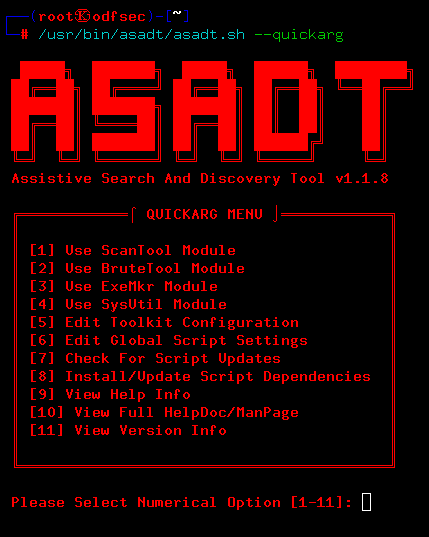

 
 

# ASADT | Assistive Search And Discovery Tool
#### Release: release-git118 \ MarkII_Alpha-v118
#### Last Update @ 04/20/2023 [ToolUpdate File (ChangeLog)](toolupdate.info)
 

# Description
A.S.A.D.T MKII (Assistive Search And Discovery Tool Mark Two) is a Bash (Bourne-Again Shell) Script.
It's purpose is to provide and easy to use and configure toolkit & GUI for select programs & scripts inside the [Kali Linux](https://www.kali.org/) and [Parrot Linux](https://www.parrotsec.org/) operating systems.    
ASADT is built on the newly designed `Bash Prog-FrameWork`, making it extremely small, fast, and simplistic. The toolkit works by applying a GUI frontend (using `zenity`) to prompt the user for necessary program/script data, then parse the inputted data to be used by the specified script or program. This completely eliminates the need to type long commands or use multiple arguments, ASADT does the dirty work for you so you can get back to what really matters, analyzing and attacking your target.
 
 
 

## Quick Install Command

`sudo` `bash` < <(`curl` `-L` `https://raw.githubusercontent.com/odf-community/ASADT/main/builder.sh`)
 
 
> Notice! This Command Requires The Following APT Packages: `wget`, `unzip` & `curl`
 
 

## Usage

1. Execute `sudo /usr/bin/asadt/asadt.sh --quickarg`

2. Execute `sudo /usr/bin/asadt/asadt.sh` --`module_name` `tool_name`

 
 

## ASADT WIKI DOCUMENTATION
1. [Installing ASADT](https://github.com/odf-community/ASADT/wiki/Installing-ASADT)  
2. [Using The CnfEdit Tool](https://github.com/odf-community/ASADT/wiki/Using-The-CnfEdit-Tool)  
3. [Using The ExeMkr Module](https://github.com/odf-community/ASADT/wiki/Using-The-ExeMkr-Module)  
4. [Using The BruteTool Module](https://github.com/odf-community/ASADT/wiki/Using-The-BruteTool-Module)  
5. [Using The ScanTool Module](https://github.com/odf-community/ASADT/wiki/Using-The-ScanTool-Module)  
 

## Editing the Configuration
To edit the configuration properly, please refer to [ASADT's HelpDoc/ManPage](build/lib/mainprog/doc/helpdoc.txt) for more information.
