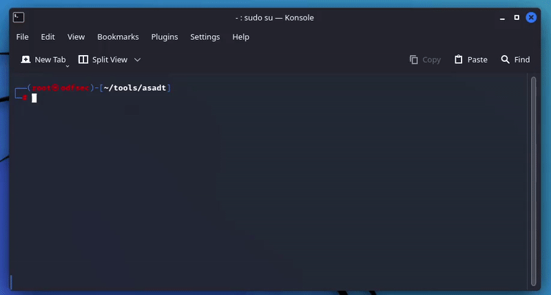

 
 

# ASADT | Assistive Search And Discovery Tool
#### Release: Mark_II-v1.0.9
#### Last Update @ 7/17/2022 [ToolUpdate File (ChangeLog)](toolupdate.info)
##### Special Thanks To [@fidian](https://github.com/fidian) For Collaboration With The [ANSI](https://github.com/fidian/ansi) Project. <3
 

# Description
A.S.A.D.T MKII (Assistive Search And Discovery Tool Mark Two) is a Bash (Bourne-Again Shell) Script.
It's purpose is to provide a modular based & easily configurable network scanning, device exploitation & bruteforcing toolkit with select tools inside of the Kali Linux operating system. No more long commands or confusing options, ASADT simplifies the process using configuration and user input and does the dirty work for you, so you can get back to what matters, analyzing and attacking the target.
 
 

## ASADT WIKI
1. [Installing ASADT](https://github.com/odf-community/ASADT/wiki/Installing-ASADT)  
2. [Using The ScanTool GUI](https://github.com/odf-community/ASADT/wiki/Using-The-ScanTool)  
3. [Using The BruteTool GUI](https://github.com/odf-community/ASADT/wiki/Using-The-BruteTool)  
4. [Using The ExeMkr GUI](https://github.com/odf-community/ASADT/wiki/Using-EXEMkr)  
 

## Editing the Configuration
To edit the configuration properly, please refer to [ASADT's HelpDoc](build/mainprog/doc/helpdoc.txt) for more information.